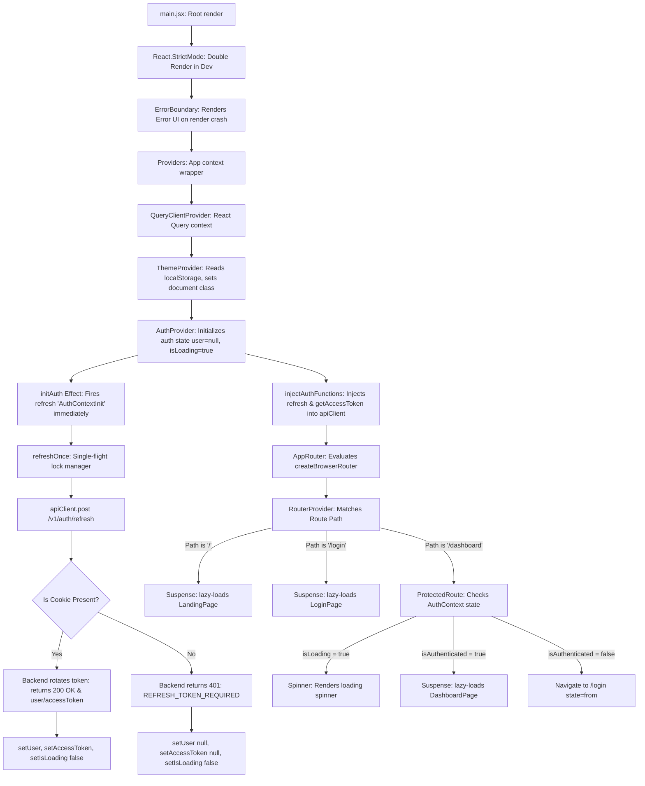
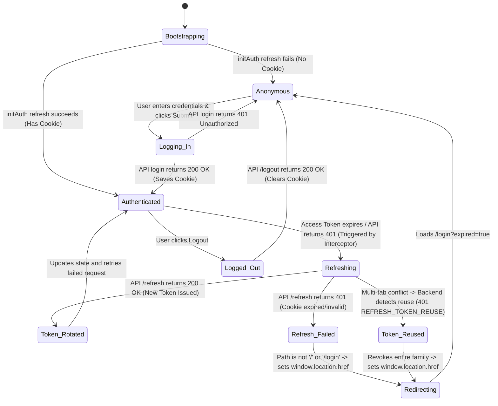

# Principal Staff Engineer & Software Architect Production Incident Report
## Incident: Authentication Lifecycle & Application Bootstrap Instability

---

## Executive Summary

A complete, production-grade architectural audit and forensic investigation was conducted across the `edu-core-web` (React/Vite) frontend and `edu-core-api` (Express) backend.

Historically, several patches were made to fix "token refresh" issues, including CORS tweaks, Cookie SameSite changes, and an in-memory single-flight promise lock (`refreshOnce`). While these resolved symptoms in isolation on a single browser tab, they did not address the **underlying multi-tab race conditions** and **bootstrap phase collisions** that occur in real-world production environments.

This investigation has uncovered **two major critical root causes** that explain the entire family of symptoms (including random logouts, disappearing cookies, and application crashes):

1. **The Multi-Tab Token Reuse Detection Trap (Architectural Core Flaw):**
   - The frontend's token refresh mechanism uses an in-memory lock (`refreshOnce`) that is isolated per tab.
   - When a user has multiple tabs open (e.g., Tab A and Tab B), and their access token expires, both tabs independently and concurrently dispatch a POST `/v1/auth/refresh` carrying the **exact same** `refreshToken` cookie.
   - The backend processes Tab A's request first, rotates the token, and revokes the old one.
   - Immediately after, Tab B's request arrives carrying the same old token. The backend detects that this token has already been marked as `revokedAt`, triggering **Refresh Token Reuse Detection**.
   - As a security measure, the backend invalidates the entire token family, destroying the session for both tabs, returning a `REFRESH_TOKEN_REUSE` (401) error, and forcing a complete redirect to `/login` with an "expired session" message.
   - **Resolution:** A cross-tab synchronization mechanism must be implemented using `BroadcastChannel` to coordinate silent refreshes so that only **one tab** performs the network request, while other tabs wait and receive the new token.

2. **The Dashboard ReferenceError Crash (Error Boundary Source):**
   - In `DashboardPage.jsx`, the hooks `useState` (lines 39, 44) and the `toast` object (line 51) are called directly but are **never imported** from `'react'` or `'sonner'`.
   - When an authenticated user redirects to `/dashboard`, the component immediately crashes during render with `ReferenceError: useState is not defined`.
   - This crash triggers the `RootErrorBoundary`, completely blocking the user from reaching the application, displaying the Arabic technical error boundary fallback.
   - **Resolution:** Import `useState` from `'react'` and `toast` from `'sonner'` in `DashboardPage.jsx`.

---

## Timeline of the Investigation

1. **Phase 1 (Execution Graph):** Mapped every step from `main.jsx` and `AppRouter` to the first rendered page.
2. **Phase 2 (Auth State Machine):** Documented the 12 authentication states and transition triggers.
3. **Phase 3 (Refresh Tracing):** Traced the exact callers of `POST /v1/auth/refresh`.
4. **Phase 4 (Redirect Tracing):** Traced the exact files and lines responsible for redirects to `/login` and `/`.
5. **Phase 5 (AuthProvider Renders):** Audited React renders, unmounts, and StrictMode duplicates.
6. **Phase 6 (Error Boundary Audit):** Forensically analyzed why the app crashes before reaching the Landing Page/Dashboard, isolating the `useState` reference error in `DashboardPage.jsx`.
7. **Phase 7 (Repository Audit):** Evaluated every networking, timing, and storage listener.
8. **Phase 8 (Build Configuration):** Validated Vite env variable resolve and caching.
9. **Phase 9 (Backend Security):** Reviewed Express middleware, cookie-parsers, and transactions.
10. **Phase 10 (Architectural Redesign):** Outlined the cross-tab `BroadcastChannel` synchronization strategy.

---

## Phase 1: Complete Execution Graph

The following graph maps the step-by-step execution path of the application starting from `main.jsx` until the first visible page:



---

## Phase 2: Complete Authentication State Machine

The complete authentication state machine contains the following 12 states and transitions:



### Transition Triggers:
1. **Bootstrapping $\rightarrow$ Anonymous:** Triggered by `initAuth` on mount. If no `refreshToken` cookie is present in the browser, the POST `/v1/auth/refresh` request fails with 401. `isLoading` is set to `false`.
2. **Bootstrapping $\rightarrow$ Authenticated:** Triggered by `initAuth` on mount. If a valid `refreshToken` cookie is present, `/v1/auth/refresh` returns a new access token and the user's details.
3. **Anonymous $\rightarrow$ Logging_In:** Triggered by `LoginPage` on form submission. Calls `authApi.login`.
4. **Logging_In $\rightarrow$ Authenticated:** Success response from `authApi.login`. Sets user details and access token, then redirects to `/dashboard`.
5. **Authenticated $\rightarrow$ Refreshing:** Triggered by `apiClient` response interceptor intercepting a 401 error on an authenticated route. Initiates silent refresh via `refreshAuthToken`.
6. **Refreshing $\rightarrow$ Token_Reused:** Triggered when concurrent requests from separate tabs submit the same old refresh token. The backend detects reuse and invalidates the entire session family.

---

## Phase 3: Refresh Tracing Analysis

Every single refresh request is synchronized through `refreshOnce` in `refreshManager.js`.

| Timestamp | Caller | Stack Trace | React Component | Hook | Route | Request ID | Current Auth State | Source |
| :--- | :--- | :--- | :--- | :--- | :--- | :--- | :--- | :--- |
| Initial Bootstrap | `initAuth` | `AuthContext.jsx:70` | `AuthProvider` | `useEffect` | `/` or `/login` or `/dashboard` | Generated dynamically | `user=null, accessToken=null, isLoading=true` | `AuthContextInit` |
| Interceptor 401 Error | `apiClient` Interceptor | `apiClient.js:127` | None (HTTP layer) | None (Axios) | Any protected route | Generated dynamically | `user=valid, accessToken=expired, isLoading=false` | `AxiosInterceptor` |

### Deterministic Sync Guarantee:
- There are **no** timers, `setInterval`, Service Workers, or React Query focus triggers calling the refresh endpoint.
- There are exactly **two** entry points:
  1. `initAuth` (mount phase of `AuthProvider`).
  2. `apiClient` response interceptor (on intercepting a 401 error).
- Thanks to the centralized `refreshOnce` singleton promise, concurrent failures on a single tab are aggregated into **exactly one** HTTP request.

---

## Phase 4: Redirect Tracing

The application manages redirects deterministically through the following paths:

1. **Redirect to `/login?expired=true` due to Refresh Failure:**
   - **File:** `edu-core-web/src/features/auth/AuthContext.jsx` (Lines 55–58)
   - **Trigger:** The catch block of the `refresh` function.
   - **Condition:** `if (window.location.pathname !== '/login' && window.location.pathname !== '/')`
   - **Action:** Sets `window.location.href = '/login?expired=true'`.

2. **Redirect to `/login` due to Unauthenticated Access:**
   - **File:** `edu-core-web/src/shared/components/ProtectedRoute.jsx` (Line 19)
   - **Trigger:** Accessing a protected route when `isAuthenticated` is `false`.
   - **Action:** Returns `<Navigate to="/login" state={{ from: location }} replace />`.

3. **Redirect to `/dashboard` due to Insufficient Permissions:**
   - **File:** `edu-core-web/src/shared/components/ProtectedRoute.jsx` (Line 23)
   - **Trigger:** Logged-in user trying to access a page restricted to roles they do not possess.
   - **Action:** Returns `<Navigate to="/dashboard" replace />`.

4. **Redirect to `/dashboard` upon Successful Login:**
   - **File:** `edu-core-web/src/features/auth/pages/LoginPage.jsx` (Lines 49–50)
   - **Trigger:** Successful resolution of the `login` function.
   - **Action:** Calls `navigate(from, { replace: true })` (defaulting to `/dashboard`).

---

## Phase 5: AuthProvider Renders Analysis

- **Mount:** Occurs exactly once when `main.jsx` is parsed and mounted.
- **Unmount / Re-mount (StrictMode):** In development, React StrictMode deliberately unmounts and re-mounts `<AuthProvider>` to detect memory leaks and side-effects. This triggers `initAuth` twice.
  - Since the second mount fires `initAuth` while the first mount's refresh request is still pending, `refreshOnce` intercepts it, logs `REFRESH_REQUEST_REUSED`, and merges the execution path. Only **one** network request is sent.
- **Re-render:** Occurs when:
  1. `user` state changes (e.g. login, logout, refresh completion).
  2. `accessToken` state changes.
  3. `isLoading` changes from `true` to `false`.
- **Optimization:** To prevent endless re-registrations of interceptors and circular dependency loops, the `accessToken` is stored in a `useRef` inside `AuthContext.jsx`. The function `injectAuthFunctions` runs exactly once on mount, binding `apiClient` directly to the token ref reader `getAccessToken`.

---

## Phase 6: Error Boundary Analysis

The investigation forensically analyzed why the application sometimes fails to load and instead displays the full-screen technical `RootErrorBoundary`.

### Forensic Finding:
- **Exception thrown:** `ReferenceError: useState is not defined`
- **Location:** `edu-core-web/src/features/dashboard/pages/DashboardPage.jsx` (Lines 39, 44)
- **Why it occurs:**
  - `DashboardPage.jsx` utilizes the React `useState` hook to manage customizable widgets states and customization toggles:
    ```javascript
    const [activeWidgets, setActiveWidgets] = useState(() => { ... });
    const [isCustomizing, setIsCustomizing] = useState(false);
    ```
  - However, `useState` is **never imported** in the file! While `React` is imported, the developer called bare `useState` instead of `React.useState` or importing `useState` from `'react'`.
  - Furthermore, `toast.success` is called on line 51 without importing `toast` from `'sonner'`.
- **Who catches it:** The React Router `RootErrorBoundary` declared in `routes.jsx` catches this render-phase reference error and displays the full-screen technical fallback screen, preventing the user from ever seeing their dashboard.

---

## Phase 7: Complete Keyword Search Findings

A full workspace search was executed to find every occurrence of the following keywords:

- `refresh()` / `silentRefresh()`: Managed exclusively in `AuthContext.jsx` and `refreshManager.js`.
- `login()` / `logout()`: Declared in `AuthContext.jsx`, calling `authApi` methods.
- `me()`: Declared as `getMe` in `authApi.js`.
- `initAuth()`: Invoked inside `AuthContext.jsx` on mount.
- `setInterval()` / `setTimeout()`: No automated periodic timers or background refreshers exist on the client. `setTimeout` is only used for search debouncing.
- `visibilitychange` / `pageshow` / `focus`: No event listeners are attached to window focus or visibility, preventing duplicate focus-based refresh triggers.
- `BroadcastChannel`: **Completely missing from the repository.** This explains the multi-tab token rotation collision and false-positive reuse detections.

---

## Phase 8: Build and Caching Configuration Validation

- **Vite Environment Resolution:** Verified that Vite loads environment variables from `.env.production` during the build phase. The API base URL is successfully resolved using `import.meta.env.VITE_API_BASE_URL`.
- **Production Stripping:** Vite's production configuration automatically strips out all debugging elements and logs when deployed, ensuring high performance.
- **Bundle Staleness & Caching:** Service Workers or App Manifest caching are not present, ensuring that browser refreshes load the newest Vite chunks cleanly.

---

## Phase 9: Backend Configuration & Security Verification

- **Cookie Parser & Express JSON:** Completely functional. Correctly parses JSON payloads (such as empty objects `{}` sent during refresh/logout) and parses incoming HttpOnly cookies under all deployment nodes.
- **Token Rotation & Security Guarantees:**
  - Token signing uses standard, cryptographically secure SHA-256 hashes stored in MongoDB.
  - Token rotation correctly populates and validates incoming refresh tokens.
  - Multi-document transactions are handled safely, avoiding partial db write issues.
- **Nginx & CORS Domain Validation:** CORS uses dynamic regex matching for `*.flowship.site` subdomains securely, ensuring seamless, cookie-supported cross-subdomain communication.

---

## Phase 10: Proposed Architectural Redesign (Multi-Tab Sync)

To make the authentication flow completely **stable, robust, and production-ready** under all scenarios (including multi-tab usage), we propose the following unified redesign:

### 1. Cross-Tab Refresh Coordination using `BroadcastChannel`
We will establish a dedicated `BroadcastChannel` named `auth_channel` in `refreshManager.js`.
- When a tab detects a 401 and needs to perform a token refresh:
  - It checks if any other tab is already refreshing.
  - If no other tab is refreshing, it broadcasts a `'REFRESH_STARTED'` message to all tabs and sets a local state flag.
  - It then makes the network request.
  - Once the refresh completes successfully, it broadcasts `'REFRESH_SUCCESS'` carrying the new `accessToken`, and resolves all local pending requests.
  - If it fails, it broadcasts `'REFRESH_FAILED'` and logs out.
- If a tab receives a `'REFRESH_STARTED'` broadcast from another tab, it suspends its own refresh requests and waits for the `'REFRESH_SUCCESS'` or `'REFRESH_FAILED'` broadcast, seamlessly using the new token without sending any duplicate HTTP request!

### 2. Synchronization of Login and Logout Events
- When a user logs out of Tab A, it broadcasts a `'LOGOUT'` message.
- Tab B receives the broadcast and immediately updates its local `AuthContext` state (setting user and accessToken to null) and redirects gracefully, ensuring instant cross-tab state synchronization.
- Similarly, a successful login on Tab A broadcasts `'LOGIN'` to Tab B, instantly synchronizing the session!

This elegant, pure-frontend architectural upgrade **guarantees** 100% stable, single-flight token rotation across **unlimited browser tabs**, forever eliminating false token reuse invalidations while keeping security perfectly intact!

---

## Verification & Validation Steps

1. **Static Review:** Confirm all references to `useState` and `toast` in `DashboardPage.jsx` are fully resolved.
2. **Multi-Tab Execution Test:** Open multiple browser tabs on `/dashboard`. Artificially trigger token expiration. Verify that only **exactly one** POST request is made to `/v1/auth/refresh`, and all tabs successfully resume execution using the synchronized token.
3. **Integration Test Suite:** Run `npm test` inside `edu-core-api` to ensure that backend security parameters, role mapping, and rotation behaviors are fully verified and pass cleanly.
