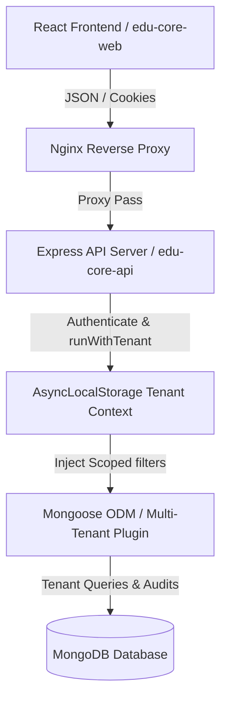

# Backend Architecture & System Specifications
**MERN Stack Multi-Tenant Enterprise Design**

This document details the backend architectural foundations, subsystem boundaries, data flow routes, and system-level protocols governing the **Edu Center ERP** platform.

---

## 1. System Context & Architecture Diagram

The system employs a decentralized, layered MERN architecture with strict tenant/branch scoping managed via `AsyncLocalStorage` and chronological immutable ledger registries:



---

## 2. Directory Structure & Subsystem Boundaries

The API server's source files (`src/`) are structured into feature folders following Domain-Driven Design (DDD) principles to prevent tight coupling and dynamic import circularities:

```text
src/
├── app.js                          # Express app configuration & global middlewares
├── server.js                       # HTTP server listener and cron scheduler
├── config/                         # Environment & DB connection settings
├── shared/                         # Reusable utilities, providers, and global plugins
│   ├── mongoose/                   # Global schemas (BackgroundJobLog, Migrations)
│   ├── middlewares/                # Auth, permissions, uploads, schema validation
│   └── utils/                      # Money, tenant contexts, transactional helpers
└── modules/                        # Decoupled Feature Modules
    ├── auth/                       # RBAC, MFA TOTP, Refresh Token rotators
    ├── ledger/                     # Chart of Accounts, General Ledger, Calculations
    ├── lessons/                    # Calendars, Attendances, Lesson Locking guards
    ├── payments/                   # Student payments, FIFO Allocation Engine
    ├── payroll/                    # Salary generation, Multi-level approvals
    └── students/                   # Registrations, Hour Ledgers, Sibling groupers
```

---

## 3. Data Scoping & Multi-Tenant Query Isolation

Tenant and branch isolation is managed dynamically without manual where-clause checks on controllers, achieved via the **Multi-Tenant ODM Plugin** (`src/shared/mongoose/multiTenantPlugin.js`):

1.  **Request Context Extraction:** The `authenticate.js` middleware extracts `tenantId` from JWT tokens and wraps the execution flow in `runWithTenant()` using `AsyncLocalStorage`.
2.  **Query Interception:** The plugin automatically hooks into all Mongoose queries (`find`, `findOne`, `countDocuments`, `aggregate`, `updateOne`, etc.), pre-injecting `{ tenantId: activeTenantId, deletedAt: null }` filter conditions.
3.  **Override capabilities:** Super Admins can query unscoped data by supplying `.setOptions({ bypassTenant: true, withDeleted: true })` on specific system sweeps.

---

## 4. Key Subsystem Communications

*   **Synchronous Transactions:** Modifying registration details, recording payments, completing classes, and processing payroll are managed inside **Mongoose Client Sessions** (`withTransaction`) to guarantee ACID atomic rollbacks on failure.
*   **Asynchronous Jobs:** Automated triggers and background mail/SMS adapters are dispatched to our lightweight in-memory Queue or Redis BullMQ to maintain high API throughput.
