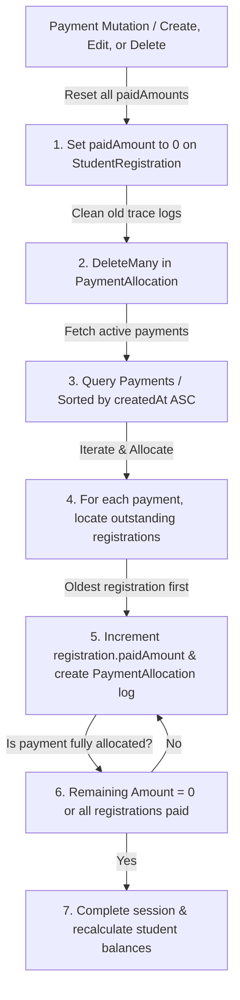

# FIFO Payment Allocation Engine Specification
**Chronological Debt Redistribution & Package Balances**

This document specifies the technical design, mathematical model, database structure, and self-healing algorithms powering the chronological First-In, First-Out (FIFO) payment allocation engine of the **Edu Center ERP** platform.

---

## 1. Context & Business Need

Previously, the ERP tracked student payments as a flat, aggregate number on the student profile. This made it impossible to:
1.  Know which specific registration packages a parent's cash receipt had paid down.
2.  Calculate exact outstanding receivables per subject package.
3.  Establish clear contract-level payment lifecycles.

To resolve this, we created the **FIFO Payment Allocation Engine** which automatically redistributes student cash receipts chronologically across their active registration packages.

---

## 2. Dynamic Allocation Workflow (The Self-Healing Loop)

Whenever a student payment is created, updated, or deleted, the system completely cleans previous records and rebuilds the chronological payment timeline from scratch under single transaction sessions (`src/modules/payments/payment.service.js`'s `reallocateAllStudentPayments()`):



---

## 3. Database Schema Specifications

### **A. PaymentAllocation Schema (`paymentAllocation.model.js`)**
```javascript
const paymentAllocationSchema = new mongoose.Schema({
  paymentId: { type: mongoose.Schema.Types.ObjectId, ref: 'Payment', required: true, index: true },
  registrationId: { type: mongoose.Schema.Types.ObjectId, ref: 'StudentRegistration', required: true, index: true },
  studentId: { type: mongoose.Schema.Types.ObjectId, ref: 'Student', required: true, index: true },
  amount: { type: Number, required: true, min: 0 }, // in fils
  allocatedAt: { type: Date, default: Date.now },
});
```

---

## 4. FIFO Allocation Mathematical Spec

Let $P = \{p_1, p_2, \dots, p_m\}$ be the list of active payments made by a student, sorted chronologically such that:

$$\text{createdAt}(p_1) \le \text{createdAt}(p_2) \le \dots \le \text{createdAt}(p_m)$$

Let $R = \{r_1, r_2, \dots, r_n\}$ be the list of registrations purchased by the student, sorted chronologically:

$$\text{registrationDate}(r_1) \le \text{registrationDate}(r_2) \le \dots \le \text{registrationDate}(r_n)$$

At initialization, set the paid amount for all registrations to zero:

$$\text{paidAmount}(r_j) = 0 \quad \forall r_j \in R$$

For each payment $p_i \in P$:
1.  Initialize remaining payment amount: $A_i = \text{amount}(p_i)$.
2.  Iterate through registrations $r_j \in R$:
    -   Calculate outstanding registration balance:
        $$\text{outstanding}(r_j) = \text{totalAmount}(r_j) - \text{paidAmount}(r_j)$$
    -   If $\text{outstanding}(r_j) \le 0$, continue to the next registration.
    -   Calculate the allocated amount:
        $$\text{allocated} = \min(A_i, \text{outstanding}(r_j))$$
    -   Update registration paid amount:
        $$\text{paidAmount}(r_j) \leftarrow \text{paidAmount}(r_j) + \text{allocated}$$
    -   Record allocation log:
        $$\text{PaymentAllocation.create}(p_i, r_j, \text{allocated})$$
    -   Decrement remaining payment amount:
        $$A_i \leftarrow A_i - \text{allocated}$$
    -   If $A_i \le 0$, terminate the allocation loop for payment $p_i$.

This mathematically self-healing allocation guarantees total consistency, prevents manual data entry tampering, and makes registration balances easily verifiable.
