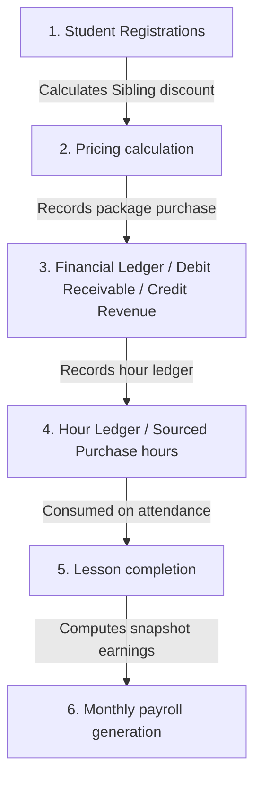

# Financial & Pricing Engine Specification
**Accrual Revenue & Immutable Contract Snapshots**

This document specifies the business algorithms, calculation services, and accounting rules powering the financial, pricing, and teacher earnings core of the **Edu Center ERP** platform.

---

## 1. Monetary Precision (Kuwaiti Fils Standard)

To prevent floating-point rounding errors and support 3-decimal precision under Kuwaiti Dinar (KWD) standards, the database represents all monetary amounts as **integer minor units (fils)**:
*   `1 KWD = 1000 fils`
*   All frontend currency and rate fields use `step="0.001"` inputs.
*   Calculations employ solid rounding logic using the `src/shared/utils/money.js` utility (`multiplyFils`, `subtractFils`, `addFils`, `toFils`, `toKWD`).

---

## 2. Business Flow & Calculations Sequence

---

## 3. Financial Formula Specs

### **A. Student Registration Package Pricing**
When a registration is created, the system calculates the discounted totals using the Strategy Pattern inside `src/shared/services/pricing.service.js`:

$$\text{Base Total} = \text{purchasedHours} \times \text{pricePerHourInFils}$$

$$\text{Discount Amount} = \text{Base Total} \times \left( \frac{\text{Sibling Discount Percentage}}{100} \right)$$

$$\text{Total Amount} = \text{Base Total} - \text{Discount Amount}$$

-   **Sibling Discount Strategy:** Sourced from `src/shared/services/pricing/discountStrategies.js`. First sibling pays full rate; subsequent siblings get flat discount rate configured in settings.

### **B. Teacher Lesson Earnings (A1 Rate Drift Protection)**
When a lesson is completed, the system calculates teacher earnings. It prioritizes the **original snapshot contract rates** from the student's registration to prevent retro-active changes:

1.  **Retrieve Snapshot Rates:**
    -   `stageHourlyRate` = `reg.pricePerHour`
    -   `teacherPct` = `reg.teacherPercentageSnapshot / 100` (defaults to 0.75 if snapshot missing)
2.  **Calculate Base Earnings:**
    -   *If Compensation Type is HOURLY:*
        $$\text{Base Earnings} = \text{stageHourlyRate} \times \text{lesson.durationHours} \times \text{teacherPct}$$
    -   *If Compensation Type is PER_LESSON:*
        $$\text{Base Earnings} = \text{lesson.lessonPrice} \times \text{teacherPct}$$
3.  **Transport Deduction:**
    -   If the teacher uses the institute's car, deduce flat transportation fee from the base earnings:
        $$\text{Transport Deduction} = \text{SettingsService.getTransportationDeductionRate(tenantId)}$$
4.  **Final Net Earnings & Revenue Split:**
    -   $$\text{Teacher Earnings} = \max(0, \text{Base Earnings} - \text{Transport Deduction})$$
    -   $$\text{Institute Revenue} = \text{lesson.lessonPrice} - \text{Teacher Earnings}$$

These calculations are encapsulated inside `FinancialCalculationService.calculateLessonEarnings` and ensure total financial auditability across all sessions.
