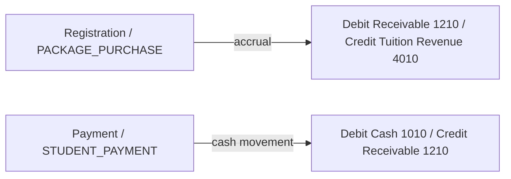

# Enterprise Double-Entry Ledger Architecture
**Dynamic Chart of Accounts & General Ledger Piping**

This document specifies the system-level double-entry general ledger architecture, transactional journal workflows, and Chart of Accounts (COA) definitions governing the **Edu Center ERP** platform.

---

## 1. Accounting Standard (Accrual Accounting Model)

The system implements strict accrual accounting principles, separating non-cash transactions (receivables and obligations) from actual cash movement.

---

## 2. Dynamic Chart of Accounts (COA) definitions

Standard enterprise accounting is managed via dynamic Accounts seeded per tenant:

| Account Number | Account Name (Arabic / English) | Account Type | Description |
|---|---|---|---|
| **1010** | النقدية بالصندوق (Cash on Hand) | `ASSET` | Physical cash on hand at the academy |
| **1020** | البنك (Cash at Bank) | `ASSET` | Main bank account and online transaction gateways |
| **1210** | حساب ذمم الطلاب المدينين (Accounts Receivable) | `ASSET` | Uncollected outstanding balances due from registered students |
| **2010** | مستحقات المعلمين (Tutors Salary Payable) | `LIABILITY` | Outstanding accrued salaries and wages due to teachers |
| **4010** | إيرادات الحصص والرسوم (Tuition Revenue) | `REVENUE` | Earned tuition revenues recognized upon enrollment |
| **4020** | مردودات الرسوم والدفعات (Tuition Returns & Refunds) | `REVENUE` | Contra-revenue account used for cancelled packages and refunds |
| **4030** | إيرادات خدمات التوصيل (Car Recovery Revenue) | `REVENUE` | Transport deductions recovered from teachers using academy cars |
| **5010** | مصاريف التشغيل والأكاديمية (Operating Expenses) | `EXPENSE` | General operational, administrative, and utility costs |

---

## 3. General Ledger Piping Workflow

Every single cash movement or accrual event recorded in the single-ledger model (`FinancialLedger`) is automatically piped into balanced, double-entry rows (`GeneralLedger`) under transactional Mongoose sessions inside `src/modules/ledger/accounting.service.js`'s `pipeLedgerToDoubleEntry()`:

### **A. Package Enrollment (`PACKAGE_PURCHASE`)**
*   **Ledger Event:** Student registers a package of $N$ hours.
*   **Journal Entries:**
    -   `DEBIT` Accounts Receivable (1210) ── *Amount: Package Total*
    -   `CREDIT` Tuition Revenue (4010) ── *Amount: Package Total*

### **B. Student Payment (`STUDENT_PAYMENT`)**
*   **Ledger Event:** Parent pays cash or transfers funds for outstanding balances.
*   **Journal Entries:**
    -   `DEBIT` Cash on Hand (1010) ── *Amount: Paid Sum*
    -   `CREDIT` Accounts Receivable (1210) ── *Amount: Paid Sum*

### **C. Teacher Payroll Payout (`TEACHER_PAYMENT`)**
*   **Ledger Event:** Accountant pays teacher wages for finalized payroll.
*   **Journal Entries:**
    -   `DEBIT` Tutors Salary Payable (2010) ── *Amount: Paid Wages*
    -   `CREDIT` Cash on Hand (1010) ── *Amount: Paid Wages*

### **D. Operating Expense (`EXPENSE`)**
*   **Ledger Event:** Administrative payouts for rent, utilities, or supplies.
*   **Journal Entries:**
    -   `DEBIT` Operating Expenses (5010) ── *Amount: Expense Total*
    -   `CREDIT` Cash on Hand (1010) ── *Amount: Expense Total*

### **E. Package Refund / Cancel (`REFUND`)**
*   **Ledger Event:** Registration is cancelled or hours are refunded.
*   **Journal Entries:**
    -   `DEBIT` Tuition Returns & Refunds (4020) ── *Amount: Refund Total*
    -   `CREDIT` Cash on Hand (1010) ── *Amount: Refund Total*

### **F. Transport Deduction (`TRANSPORT_DEDUCTION`)**
*   **Ledger Event:** Deducing transport fees from teachers.
*   **Journal Entries:**
    -   `DEBIT` Tutors Salary Payable (2010) ── *Amount: Deducted sum*
    -   `CREDIT` Car Recovery Revenue (4030) ── *Amount: Deducted sum*

This strictly balanced model ensures debits always equal credits, maintaining 100% financial and mathematical alignment at the core ledger database level.
