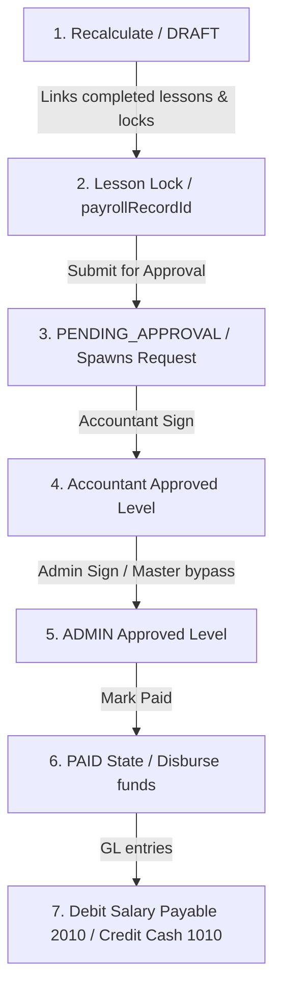

# Tutors Payroll & Wages Lifecycle Specification
**Salary Generation, Multi-Signature Approvals & Lesson Locks**

This document specifies the end-to-end operational workflows, approval chains, and automated locking mechanisms governing teacher payroll and completed lesson lifecycles in the **Edu Center ERP** platform.

---

## 1. Context & Business Need

To prevent fraud, wage discrepancies, and unauthorized edits of paid financial histories, we established a strict multi-layered payroll lifecyle:
1.  **Recalculation / Generation:** Aggregate completed lesson earnings for a specific period.
2.  **Locking:** Completed lessons get associated with the payroll record and are made completely immutable.
3.  **Approval Chain:** Requires sequential, role-verified electronic signatures before payment is enabled.
4.  **Disbursement:** Pay salaries and generate general ledger entries atomically.

---

## 2. Comprehensive Payroll Lifecycle Diagram



---

## 3. Operational Workflow Specifications

### **A. Generation & Lesson Locking**
When payroll is generated or recalculated (`payroll.service.js`'s `recalculateForTeacher()`), the system:
1.  Queries all `COMPLETED` status lessons for the teacher inside the target month/year range.
2.  Calculates bases, bonuses, penalties, and transportation deductions.
3.  Upserts the `PayrollRecord` document in `CALCULATED` status.
4.  Locks all selected completed lessons by setting their `payrollRecordId = payrollRecord._id` under transactional sessions.

### **B. Lesson Immutability Pre-Hooks (`lesson.model.js`)**
If any process or user attempts to save, edit, or delete a lesson, the `pre('save')`, `pre('remove')`, and query-level pre-hooks (`updateOne`, `updateMany`, `findOneAndUpdate`, `deleteOne`, `deleteMany`, `findOneAndDelete`) verify:
```javascript
const checkAndBlockIfLocked = async (payrollRecordId) => {
  if (payrollRecordId) {
    const PayrollRecord = mongoose.model('PayrollRecord');
    const pr = await PayrollRecord.findById(payrollRecordId);
    if (pr && ['PENDING_APPROVAL', 'APPROVED', 'PAID'].includes(pr.status)) {
      throw new Error('لا يمكن تعديل أو حذف حصة مغلقة ومدرجة في كشف الرواتب المعتمد');
    }
  }
};
```
This guarantees complete data and audit trails immutability across the system.

### **C. Sequential Approval Engine**
The approval engine (`approval.service.js`'s `approveStep()`) enforces strict step-by-step role verification:
-   **Step 0 (`ACCOUNTANT`):** Only a user with role `'ACCOUNTANT'` (or an explicit Admin override/bypass) can sign.
-   **Step 1 (`ADMIN`):** Fulfills final administrative authorization.
-   **Bypass Rule:** If `userRole === 'ADMIN'`, the system executes a master override loop, signing all remaining steps to fast-track approvals for business agility.

### **D. Salary Disbursement (`payPayroll()`)**
Marking a payroll as `PAID`:
1.  Changes `PayrollRecord` status to `PAID` and sets `paid: true`.
2.  Removes any stale previous ledger entries for this payroll reference to prevent duplicates.
3.  Dispatches balanced double-entries to the Chart of Accounts under transaction sessions:
    -   `DEBIT` Tutors Salary Payable (2010)
    -   `CREDIT` Cash on Hand (1010)
